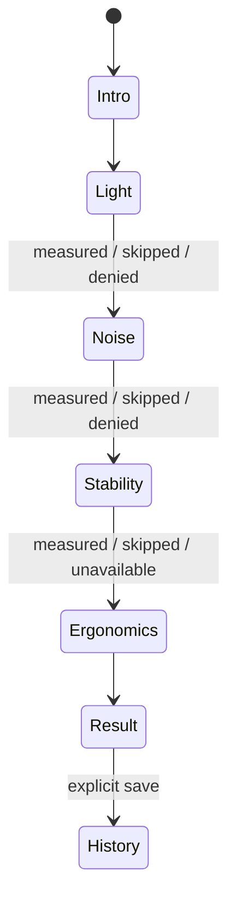

# Architecture

Bameyasu is a dependency-free iOS 17 SwiftUI app generated from `project.yml` with XcodeGen.

## State flow



`ScanCoordinator` is the single main-actor state machine. Each sensor starts only for its own stage and stops after completion, cancellation, error, or view dismissal. Permission denial creates an unavailable metric and never blocks the rest of the flow.

## Boundaries

- `LightMeter`: AVFoundation session, exposure estimate, frame luma analysis; no photo/video output.
- `SoundMeter`: AVAudioEngine input tap, in-memory A weighting and energy averaging; no audio file or speech recognition.
- `MotionMeter`: Core Motion user-acceleration RMS and gravity-derived tilt.
- `AssessmentEngine`: pure deterministic mapping from readings to display results, recommendations, and algorithm-versioned score.
- `HistoryStore`: JSON summaries in Application Support; no raw sensor data.
- Views: Dynamic Type-first SwiftUI with semantic colors, non-color status icons, and VoiceOver labels.

## Data lifecycle

```text
sensor callback → transient numeric sample → aggregate result → local JSON summary
                  └── raw frame/audio/motion is discarded
```

There is no networking code. External official-source links open only after a user action.

## Adding a sensor

Before implementation:

1. Confirm that a public App Store API exists without a restricted entitlement.
2. Define the physical quantity and distinguish raw units from desired display units.
3. Document calibration, sample duration, error, failure conditions, and reference instrument.
4. Add an unavailable path; never infer the value from an unrelated sensor.
5. Decide whether validation supports inclusion in the readiness score.
6. Update privacy, permission copy, methodology, sources, tests, and algorithm version.
